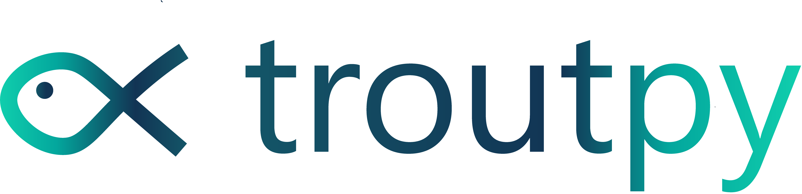

# troutpy

[![Tests][badge-tests]][tests]
[![Documentation][badge-docs]][documentation]

[badge-tests]: https://img.shields.io/github/actions/workflow/status/theislab/troutpy/test.yaml?branch=main
[badge-docs]: https://img.shields.io/readthedocs/troutpy

Package for the analysis of unassigned RNA during segmentation in image-based spatial transcriptomics, in python.



## Getting started

Please refer to the [documentation][],
in particular, the [API documentation][].

## Installation

You need to have Python 3.10 or newer installed on your system.
If you don't have Python installed, we recommend installing [Miniforge][].

There are several alternative options to install troutpy:

1. Install the latest release of `troutpy` from [PyPI][]:

```bash
pip install troutpy
```

1. Install the latest development version:

```bash
pip install git+https://github.com/theislab/troutpy.git@main
```

Some functionality (spatial statistics, segmentation-free clustering, chord-diagram
plots, morphological metrics, factor analysis, vendor-format readers) requires
optional extras. Install everything with `pip install "troutpy[all]"`, or pick
individual extras (`spatial-stats`, `segmentation-free`, `chord`, `morphology`,
`factor-analysis`, `io`, `viz`) as needed.

## Usage

troutpy follows the [scverse][] API conventions: preprocessing in `tp.pp`, analysis tools in
`tp.tl` and plotting in `tp.pl`, all operating on a [SpatialData][] object.

```python
import spatialdata as sd
import troutpy as tp

sdata = sd.read_zarr("data.zarr")

# classify unassigned transcripts into cell-like RNA and uRNA
tp.pp.segmentation_free_sainsc(sdata, binsize=5, celltype_key="leiden")
tp.pp.define_urna(sdata, method="sainsc")

# characterize uRNA per gene and infer its source cells
tp.tl.quantify_overexpression(sdata, codeword_key="control_probe")
tp.tl.extracellular_enrichment(sdata)
tp.tl.density_similarity(sdata)
tp.tl.adaptative_source_score_optimized(sdata, cell_type_col="leiden")
```

See the [basic tutorial][] for a complete, step-by-step walkthrough on a public Xenium mouse brain dataset.

## Reproducibility

Code, notebooks, and instructions to reproduce the results from the paper are available at the [reproducibility repository](https://github.com/theislab/troutpy_reproducibility). This repository also includes diverse tutorials and complementary functions that are not core to Troutpy, but are required to reproduce the figures from Marco Salas et al. 2025.

## Release notes

See the [changelog][].

## Contact

For questions and help requests, you can reach out in the [scverse discourse][].
If you found a bug, please use the [issue tracker][].

## Citation

> t.b.a

[miniforge]: https://github.com/conda-forge/miniforge
[scverse]: https://scverse.org
[spatialdata]: https://spatialdata.scverse.org
[basic tutorial]: https://troutpy.readthedocs.io/en/latest/notebooks/Basic_tutorial.html
[scverse discourse]: https://discourse.scverse.org/
[issue tracker]: https://github.com/theislab/troutpy/issues
[tests]: https://github.com/theislab/troutpy/actions/workflows/test.yaml
[documentation]: https://troutpy.readthedocs.io
[changelog]: https://troutpy.readthedocs.io/en/latest/changelog.html
[api documentation]: https://troutpy.readthedocs.io/en/latest/api/index.html
[pypi]: https://pypi.org/project/troutpy
[images/logo_fish.png]: images/logo_fish.png
